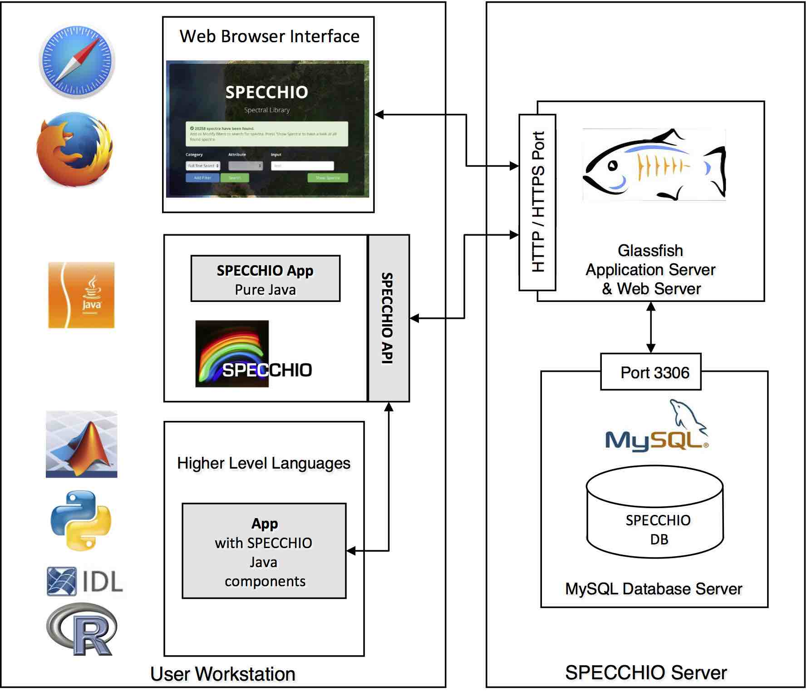

<!-- Features -->

  <!-- Webapp -->
  <feature-card
    absolute
    :icon="['fas', 'database']"
    :to="$site.themeConfig.specchioWebinterface"
    class="column is-4">

#### SPECCHIO Web Interface
The Web Interface allows you searched the database directly for spectral data by
web browser without installing additional software.

  </feature-card>

  <!-- Download -->
  <feature-card
    :icon="['fas', 'download']"
    to="/downloads/"
    class="column is-4">

#### SPECCHIO Client / VM
Download the latest SPECCHIO Client Application. We have installers for MacOS,
Windows and Linux. We also provide a preconfigured VirtualBox VM with everything
installed you need.

  </feature-card>

  <!-- Guides -->
  <feature-card
    :icon="['fas', 'book']"
    to="/guides/"
    class="column is-4">

#### Guides
We provide guides with detailed installation instructions, technical background
information and tutorials for the SPECCHIO client application. Furthermore,
there are also guides on how to access SPECCHIO directly from Matlab and R.

  </feature-card>  

<!-- Teaser -->

## Perfect for research!
Learn more by reading our leaflet: [SPECCHIO Leaflet](ftp://v473.vanager.de/Flyers/SPECCHIO Leaflet V3.3.pdf)
Programmatic access from e.g. Matlab or R.
Check out the [tutorials](/programming-course/)
and our extensive [API documentation](https://specchio.ch/javadoc/).

::: slot twitter
<!-- Tweets -->
<client-only>
  <twitter-feed/>
</client-only>
:::
